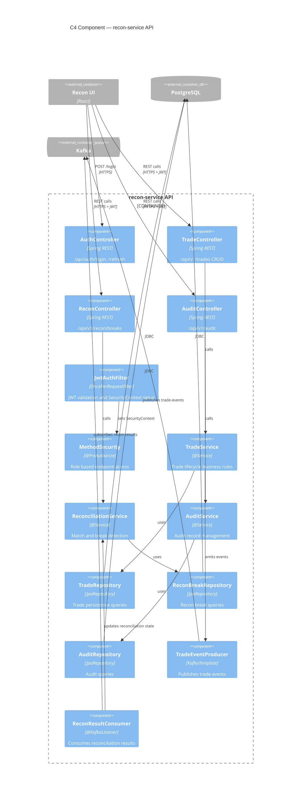

```mermaid
C4Component
    title C4 Component — recon-service API

    Container_Ext(reactSpa, "Recon UI", "React")
    ContainerDb_Ext(postgres, "PostgreSQL")
    ContainerQueue_Ext(kafka, "Kafka")

    Container_Boundary(api, "recon-service API") {

        Component(authCtl, "AuthController", "Spring REST", "/api/auth/login, /refresh")
        Component(tradeCtl, "TradeController", "Spring REST", "/api/v1/trades CRUD")
        Component(reconCtl, "ReconController", "Spring REST", "/api/v1/recon/breaks")
        Component(auditCtl, "AuditController", "Spring REST", "/api/v1/audit")

        Component(jwtFilter, "JwtAuthFilter", "OncePerRequestFilter", "JWT validation and SecurityContext setup")
        Component(rbac, "MethodSecurity", "@PreAuthorize", "Role based endpoint access")

        Component(tradeSvc, "TradeService", "@Service", "Trade lifecycle business rules")
        Component(reconSvc, "ReconciliationService", "@Service", "Match and break detection")
        Component(auditSvc, "AuditService", "@Service", "Audit record management")

        Component(tradeRepo, "TradeRepository", "JpaRepository", "Trade persistence queries")
        Component(reconRepo, "ReconBreakRepository", "JpaRepository", "Recon break queries")
        Component(auditRepo, "AuditRepository", "JpaRepository", "Audit queries")

        Component(producer, "TradeEventProducer", "KafkaTemplate", "Publishes trade events")
        Component(consumer, "ReconResultConsumer", "@KafkaListener", "Consumes reconciliation results")
    }

    Rel(reactSpa, authCtl, "POST /login", "HTTPS")
    Rel(reactSpa, tradeCtl, "REST calls", "HTTPS + JWT")
    Rel(reactSpa, reconCtl, "REST calls", "HTTPS + JWT")
    Rel(reactSpa, auditCtl, "REST calls", "HTTPS + JWT")

    Rel(jwtFilter, rbac, "sets SecurityContext")

    Rel(tradeCtl, tradeSvc, "calls")
    Rel(reconCtl, reconSvc, "calls")
    Rel(auditCtl, auditSvc, "calls")

    Rel(tradeSvc, tradeRepo, "uses")
    Rel(reconSvc, reconRepo, "uses")
    Rel(auditSvc, auditRepo, "uses")

    Rel(tradeRepo, postgres, "JDBC")
    Rel(reconRepo, postgres, "JDBC")
    Rel(auditRepo, postgres, "JDBC")

    Rel(tradeSvc, producer, "emits events")
    Rel(producer, kafka, "publishes trade-events")
    Rel(consumer, kafka, "subscribes recon-results")
    Rel(consumer, reconSvc, "updates reconciliation state")
```