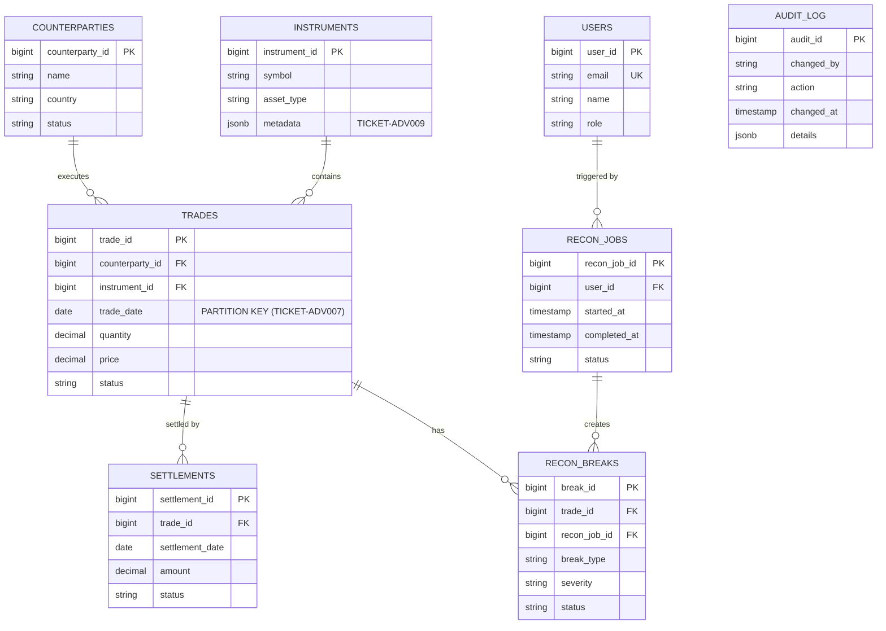

# ReconX Entity Relationship Diagram

```mermaid
erDiagram

    COUNTERPARTIES ||--o{ TRADES : "executes"
    INSTRUMENTS ||--o{ TRADES : "contains"
    TRADES ||--o{ SETTLEMENTS : "settled by"
    TRADES ||--o{ RECON_BREAKS : "has"
    RECON_JOBS ||--o{ RECON_BREAKS : "creates"
    USERS ||--o{ RECON_JOBS : "triggered by"

    COUNTERPARTIES {
        bigint counterparty_id PK
        string name
        string country
        string status
    }

    INSTRUMENTS {
        bigint instrument_id PK
        string symbol
        string asset_type
        jsonb metadata "TICKET-ADV009"
    }

    USERS {
        bigint user_id PK
        string email UK
        string name
        string role
    }

    TRADES {
        bigint trade_id PK
        bigint counterparty_id FK
        bigint instrument_id FK
        date trade_date "PARTITION KEY (TICKET-ADV007)"
        decimal quantity
        decimal price
        string status
    }

    SETTLEMENTS {
        bigint settlement_id PK
        bigint trade_id FK
        date settlement_date
        decimal amount
        string status
    }

    RECON_JOBS {
        bigint recon_job_id PK
        bigint user_id FK
        timestamp started_at
        timestamp completed_at
        string status
    }

    RECON_BREAKS {
        bigint break_id PK
        bigint trade_id FK
        bigint recon_job_id FK
        string break_type
        string severity
        string status
    }

    AUDIT_LOG {
        bigint audit_id PK
        string changed_by
        string action
        timestamp changed_at
        jsonb details
    }
```